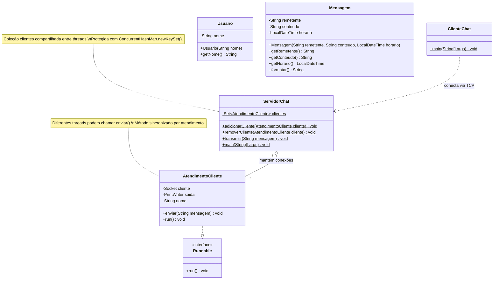

# Chat Multiusuário com Histórico

Projeto de Programação Orientada a Objetos do 2º bimestre.

## Objetivo

Desenvolver um chat em Java no qual vários clientes possam se conectar
ao mesmo servidor, trocar mensagens e ter suas mensagens salvas em
um histórico no banco de dados.

## Tecnologias

- Java: código compilado para Java 21.
- JDK 26 utilizado no ambiente de desenvolvimento.
- Maven.
- Sockets TCP e threads.
- JUnit 5 para testes unitários.
- JDBC para persistência — a implementar.

## Requisitos do projeto completo

- Servidor com socket de escuta e uma thread por conexão.
- Classe de atendimento que implementa Runnable.
- Coleção de clientes protegida para acesso concorrente.
- Broadcast das mensagens para os clientes conectados.
- Mensagem com remetente, conteúdo e horário.
- Persistência de mensagens via JDBC.
- Repository/DAO isolando o SQL.
- Pelo menos 5 testes JUnit sem depender de rede ou banco real.
- Pacotes separados por responsabilidade.

## Rubrica de avaliação

| Critério | Pontuação |
|---|---:|
| Múltiplos clientes simultâneos | 1,3 |
| Broadcast sem perder mensagens | 1,2 |
| Persistência JDBC | 1,0 |
| Pacotes e responsabilidades | 0,5 |
| Testes unitários | 0,5 |
| Código e relatório | 0,5 |
| Total | 5,0 |

## Organização

- model: classes e regras do domínio.
- server: servidor e atendimento dos clientes.
- client: aplicação cliente.
- persistence: implementação do acesso ao banco.

O domínio não deve depender de rede, arquivos ou JDBC.
A persistência será acessada por uma interface Repository.

## Estado atual

Implementados e verificados manualmente:

- Conexão de múltiplos clientes.
- Uma thread de atendimento por cliente.
- Identificação dos usuários pelo nome.
- Broadcast de mensagens.
- Avisos de entrada e saída.
- Comando /sair.

Usuario e Mensagem foram implementados, com 5 testes passando.
Ainda faltam a integração do domínio ao chat, o histórico via JDBC
e a validação do broadcast sob concorrência.

## Como compilar

```bash
mvn clean compile
```

## Como executar

Inicie o servidor:

```bash
java -cp target/classes br.com.luka.chat.server.ServidorChat
```

Em outro terminal, inicie um cliente:

```bash
java -cp target/classes br.com.luka.chat.client.ClienteChat
```

Repita o comando do cliente em outros terminais para simular usuários.
O comando java deve apontar para Java 21 ou superior.

## Uso de IA

O ChatGPT foi utilizado para orientar a configuração do ambiente,
explicar sockets e threads e auxiliar na construção do código por etapas.

A IA também auxiliou na elaboração dos testes e das classes do domínio.
A validação incluiu compilação, testes manuais com dois clientes
e execução de 5 testes automatizados pelo Maven.
## Diagrama de classes — estado atual



As classes Usuario e Mensagem já foram implementadas e testadas,
mas ainda não estão integradas ao fluxo de rede.

A interface Repository e sua implementação JDBC serão acrescentadas
na etapa de persistência.

## Testes automatizados

Execute:

```bash
mvn test
```

Foram executados 5 testes com sucesso, sem rede ou banco:

- Recusar remetente vazio.
- Recusar conteúdo vazio.
- Formatar mensagem com horário, remetente e conteúdo.
- Recusar nome de usuário vazio.
- Remover espaços nas extremidades do nome.

Os testes foram escritos antes das respectivas classes.
Inicialmente, a compilação falhou pela ausência das classes.
Após a implementação, os 5 testes passaram.